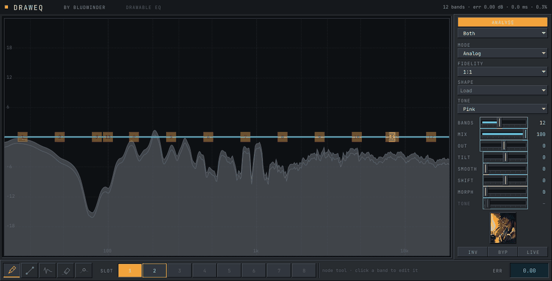
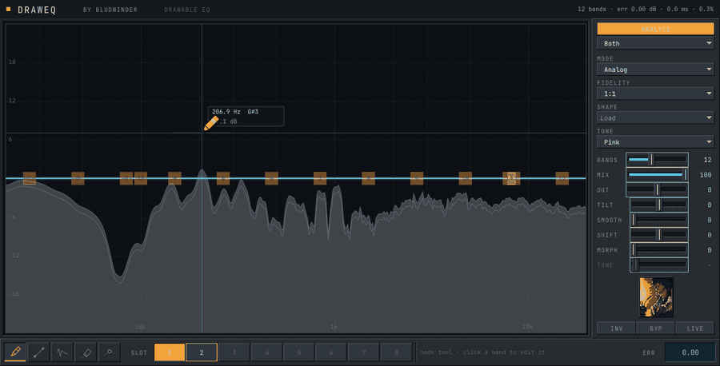

<h1 align="center">DrawEQ</h1>

<p align="center">
  <b>Draw the frequency response you want. The plugin figures out how to be it.</b>
</p>

<p align="center">
  <a href="https://github.com/whysush/DrawEQ/releases/latest/download/DrawEQ.msi">
    
  </a>
  <a href="https://paypal.me/bludwinder">
    
  </a>
</p>

<p align="center">
  <a href="https://github.com/whysush/DrawEQ/actions/workflows/ci.yml">
    
  </a>
  
  
</p>



---

**The problem**: Most EQs make you translate. If you have to change the nature of the sound at one particular point of the curve, you have to pick a band, frequency, Q and gain. Personally, manipulating the bands leads to my curve taking on a shape I didn't even want. 

**The idea**:
Draw the shape freehand, however you like it. DrawEQ fits twelve bands to within 0.43 dB of what you drew, all with zero latency. Furthermore, the bands are still labelled, draggable and automatable. 

Also, you can either draw full curves or even edit specific parts of the curve using the pencil. 

## Broad strokes or surgical

Same pencil, same gesture, very different job:



A deep, narrow cut drawn freehand and fitted to 0.34 dB. Watch the grey
analyser underneath: the hole appears in the spectrum exactly where the stroke
went. You're not approximating a notch by feel. You're drawing one.

## What's in it

| | |
|---|---|
| **Analog mode** | Fits a cascade of biquads to your stroke. Zero latency, ordinary EQ phase behaviour, and real bands you can edit afterwards. |
| **Spectral mode** | Turns the curve straight into an FFT filter. Matches anything however sharp, and charges you either latency (linear phase) or phase rotation (minimum phase). |
| **It shows you the gap** | A ghost line where your hand went, a plotter line for what you actually got, and a shaded ribbon between them. When the fit is exact the ribbon vanishes. When it isn't, it blooms at the frequency giving the fitter trouble, so you can *see* the disagreement instead of guessing. |
| **Live analyser** | Constant-Q band energy, not raw FFT bins, so pink noise reads flat and a tone is the same width at 100 Hz as at 10 kHz. |
| **8 slots + morph** | `morph` blends from flat toward what you drew, continuous at zero. You can't automate a gesture, but you can automate this — same shape either way. |
| **Never allocates on the audio thread** | Not a claim. `TestRealtimeSafety` traps every allocation and fails the build if one happens. |

---

## Get it

<p align="center">
  <a href="https://github.com/whysush/DrawEQ/releases/latest/download/DrawEQ.msi">
    
  </a>
</p>

Run it. The installer drops the plugin into `C:\Program Files\Common Files\VST3`
(creating that folder if you don't have one) and offers the standalone app as a
tickbox.

Windows will throw up a blue "Windows protected your PC" box first. Click
**More info** → **Run anyway**.

Then tell your host about it:

- **FL Studio** — Options → Manage plugins. Check that
  `C:\Program Files\Common Files\VST3` is in the VST3 search paths, then hit
  **Find more plugins**. It shows up under Effects.
- **Ableton, Reaper, Bitwig, Studio One** — just rescan. They all check the
  Common Files path by default.

If you prefer to place the folder yourself, every release also carries
`DrawEQ-Windows-VST3.zip`. Unzip it, drop `DrawEQ.vst3` wherever your host
looks.

Note: The binaries for this tool aren't signed, so SmartScreen complains the first time you try to run it. It's purely a certificate issue and I guarantee you it's not a safety issue whatsoever. Kindly ignore it. If it's still bothering you, you may build it yourself using CI. 

---

## Donations (purely optional!)

<p align="center">
  <a href="https://paypal.me/bludwinder">
    
  </a>
</p>

DrawEQ is completely free, and it's staying free. I built it because I wanted it to exist
and nobody was going to build it for me, and I understand that there are people like me who may also need something like this. 

That said, if you find it truly useful, and you have some money to spare, please do consider donating as that would motivate to better the software. It's completely optional!

Please do report any bugs and crashes you come across. 

---

## Using it

| | |
|---|---|
| wheel | brush radius, measured in octaves, so it feels the same at 60 Hz as at 6 kHz |
| `Shift` | lock to constant dB |
| `Alt` | smooth, just while held |
| `Ctrl` / `Cmd` | fine adjust |
| right-drag | erase back toward flat |
| double-click | flatten one octave |
| `Ctrl+Z` | undo, a whole stroke at a time rather than a pixel at a time |

The Node tool is the one worth understanding. Draw, and you get bands. Drag a band, and the curve rewrites itself to match. Draw again and it re-fits. Gesture and precision in the same tool.

Slots behave how you would expect: click to select the one you are drawing into, shift-click to store, alt-click to clear, right-click to set it as the morph target.

---

<details>
<summary><b>Building it yourself</b></summary>

You need CMake 3.22+ and a C++20 compiler. JUCE 8.0.9, Eigen 3.4 and Catch2 v3
get fetched and pinned for you.

```bash
./Tools/fetch_fonts.sh          # once — grabs the two SIL OFL typefaces
cmake -S . -B build -DCMAKE_BUILD_TYPE=RelWithDebInfo
cmake --build build --parallel
```

On Linux you'll want the usual JUCE dependencies first:

```bash
sudo apt-get install libasound2-dev libx11-dev libxext-dev libxrandr-dev \
  libxcursor-dev libxinerama-dev libxcomposite-dev libfreetype6-dev \
  libfontconfig1-dev libgl1-mesa-dev
```

Everything lands in `build/DrawEQ_artefacts/` — a VST3 and a standalone.

The Windows installer is built by CI, because WiX only runs on Windows and
means it. To build one on a Windows machine:

```bash
./Installer/build-msi.sh <vst3-bundle-dir> <standalone-exe> DrawEQ.msi
```

</details>

<details>
<summary><b>Tests</b></summary>

```bash
ctest --test-dir build --output-on-failure
```

Headless on purpose. Core and DSP link only `juce_dsp`, so there's no display
server involved and they run anywhere, CI included. What each one is actually
protecting:

| File | What it protects |
|---|---|
| `TestLogGrid` | the one frequency↔index mapping, and an octave being the same width wherever it sits |
| `TestCurveModel` | brushes, gesture-level undo, state round-trip, rejecting corrupt state |
| `TestIRBuilder` | flat curve → exact unit impulse; built IR matches its target within 0.1 dB; deep notches stay finite |
| `TestConvolution` | UPOLS against direct convolution at every block size, plus latency and the unit-impulse null |
| `TestBiquadCascade` | that the closed form **is** the running filter, and that the analytic Jacobian is right |
| `TestCurveFitter` | a regression corpus with recorded error bounds, and both timing budgets |
| `TestBandMatcher` | 500 frames of a morphing curve with no band jumping more than one position |
| `TestStateRing` | the publish/consume/recycle protocol, including under contention |
| `TestNull` | flat curve nulls against dry audio in all three modes |
| `TestSweeps` | every sample rate × block size, prepare/release cycles, automation thrash |
| `TestRealtimeSafety` | a global allocation trap proving the audio path never allocates |

Plus validation at the strictest level pluginval offers:

```bash
pluginval --strictness-level 10 --validate build/.../DrawEQ.vst3
```

</details>

<details>
<summary><b>Tools</b></summary>

None of these ship. They exist to answer questions the tests can't.

```bash
# Loads the built VST3 through JUCE's own VST3 host and abuses it the way a DAW
# does: odd buffer lengths, the sample rate changing underneath, a latency
# change mid-playback, state across save/reload, four instances at once,
# bypass, and a window opened and closed over and over.
./build/DrawEQHostSim_artefacts/*/DrawEQHostSim \
    build/DrawEQ_artefacts/*/VST3/DrawEQ.vst3

# Fit quality and timing across a corpus — "did that change actually help?"
./build/DrawEQFitBench_artefacts/*/DrawEQFitBench 24

# Render the editor to a PNG. No window, no audio device.
./build/DrawEQSnapshot_artefacts/*/DrawEQSnapshot out.png ribbon

# The GIFs above, start to finish. DrawEQFrames drives the real canvas with
# synthesised mouse events, so what gets recorded is the actual drawing path
# rather than a re-enactment of it. Modes: sketch | notch
./build/DrawEQFrames_artefacts/*/DrawEQFrames frames sketch
./Tools/make_gifs.py frames docs/media/draw.gif --width 900 --colors 128
```

</details>

<details>
<summary><b>How it's put together</b></summary>

```
Source/
  Core/     CurveModel, LogGrid, CurveShaping, Params, PresetBank
  DSP/      IRBuilder, Cepstrum, ConvolutionEngine, BiquadCascade,
            CurveFitter, BandMatcher, Analyzer, StateRing, CurveWorker
  UI/       Theme, CurveCanvas, CanvasLayers/, Tools/, Controls/, Editor
```

Three threads, data flowing one way. The message thread owns the curve. A
worker thread turns it into a `FilterState`. The audio thread crossfades to
that state and hands the old one back to be freed somewhere it's safe to free
things. The audio thread never allocates, never locks, never destroys, and
`TestRealtimeSafety` asserts that rather than taking my word for it.

</details>

---

Want the long version? [CONTEXT.md](CONTEXT.md) is the original specification,
and [DECISIONS.md](DECISIONS.md) is every place the implementation departed
from it, with the reasoning and the measurements that prompted it. That second
file is the honest one. The bugs are in there too.

Built with [JUCE](https://juce.com) and [Eigen](https://eigen.tuxfamily.org).
Typefaces are JetBrains Mono and Space Grotesk, both SIL OFL.
