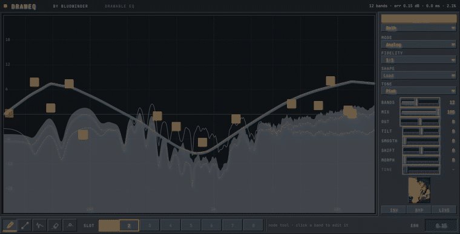

# DrawEQ

Draw the frequency response you want. The plugin figures out how to be it.


That's the whole idea. You sketch a shape with a pencil, let go, and DrawEQ
works out a filter that matches what you drew — in the clip above, twelve bands
landing within 0.15 dB of the stroke, at zero latency.

## Why bother

Every EQ makes you translate. You hear "there's too much boxiness around 400"
and then you go hunting for the right band, the right Q, the right amount of
cut. The knobs are in the way of the thing you already know you want.

So: skip the translation. Draw the shape. DrawEQ handles the rest, and hands
you back real bands you can grab and nudge afterwards if the fit isn't quite
right.

## Two ways of getting there

**Analog** is the default. A background optimiser fits a cascade of biquads to
your stroke. Zero latency, the phase behaviour you'd expect from a normal EQ,
and — the part I like most — it gives you back *labelled, draggable,
automatable bands*. You drew a gesture and got an editable band stack out of
it. No conversion step, no mode switch.

**Spectral** turns the curve straight into an FFT-domain filter. It'll match
anything, however sharp, but you pay for it: either latency (linear phase) or
phase rotation (minimum phase). Reach for it when you need a notch that no
biquad cascade is going to give you.

The display always shows you both sides of that bargain — a graphite ghost
where your hand went, a plotter line for what you actually got, and a shaded
ribbon between them. When the fit is exact the ribbon disappears. When it
isn't, it blooms at the exact frequency that's giving the fitter trouble, so
you can see the disagreement instead of guessing at it.

## Morph



`morph` blends from flat toward whatever you drew, and it's continuous at zero.
That's what makes a drawing automatable — you can't automate a gesture, but you
can automate this, and it's the same shape either way.

---

## Installing (Windows)

Grab `DrawEQ.msi` from [the latest
release](https://github.com/whysush/DrawEQ/releases) and run it. It drops the
plugin into `C:\Program Files\Common Files\VST3` (creating that folder if you
don't have one) and offers the standalone app as a tickbox.

Windows will throw up a blue "Windows protected your PC" box first. Click
**More info** → **Run anyway**. [Here's why](#about-that-warning), and it isn't
because something's wrong with the download.

Then tell your host about it:

- **FL Studio** — Options → Manage plugins. Make sure
  `C:\Program Files\Common Files\VST3` is in the VST3 search paths, then hit
  **Find more plugins**. It shows up under Effects.
- **Ableton, Reaper, Bitwig, Studio One** — just rescan. They all check the
  Common Files path by default.

If you'd rather place the folder yourself, the release also has
`DrawEQ-Windows-VST3.zip`. Unzip, drop `DrawEQ.vst3` wherever your host looks.

### About that warning

The binaries aren't signed, so SmartScreen complains the first time. That's a
paperwork problem, not a code problem — killing the warning needs a certificate
issued by a certificate authority against a verified legal identity, which
costs a few hundred a year. Self-signing doesn't help: it produces a signature
nobody else's machine trusts, so you get the warning anyway and the only thing
gained is the feeling of having dealt with it.

The build is ready for a real one whenever there is one. CI signs the plugin,
the standalone and the installer — timestamped — as soon as
`WINDOWS_CERT_BASE64` and `WINDOWS_CERT_PASSWORD` exist in the repo secrets,
and quietly skips signing when they don't.

---

## Using it

| | |
|---|---|
| `P` `L` `S` `E` `N` | pencil, line, smooth, erase, node |
| wheel | brush radius, measured in octaves — so it feels the same at 60 Hz as at 6 kHz |
| `Shift` | lock to constant dB |
| `Alt` | smooth, just while held |
| `Ctrl` / `Cmd` | fine adjust |
| right-drag | erase back toward flat |
| double-click | flatten one octave |
| `Ctrl+Z` | undo — a whole stroke at a time, not a pixel at a time |

The **Node** tool is the one worth understanding. Draw, and you get bands. Drag
a band, and the curve rewrites itself to match. Draw again and it re-fits.
Gesture and precision in the same tool.

Slots work like you'd expect: click to select the one you're drawing into,
shift-click to store, alt-click to clear, right-click to set it as the morph
target.

---

## Building it yourself

You need CMake 3.22+ and a C++20 compiler. JUCE 8.0.9, Eigen 3.4 and Catch2 v3
get fetched and pinned for you.

```bash
./Tools/fetch_fonts.sh          # once — grabs the two SIL OFL typefaces
cmake -S . -B build -DCMAKE_BUILD_TYPE=RelWithDebInfo
cmake --build build --parallel
```

On Linux you'll want the usual JUCE dependencies first:

```bash
sudo apt-get install libasound2-dev libx11-dev libxext-dev libxrandr-dev \
  libxcursor-dev libxinerama-dev libxcomposite-dev libfreetype6-dev \
  libfontconfig1-dev libgl1-mesa-dev
```

Everything lands in `build/DrawEQ_artefacts/` — a VST3 and a standalone.

## Tests

```bash
ctest --test-dir build --output-on-failure
```

They're headless on purpose. Core and DSP link only `juce_dsp`, so there's no
display server involved and they run anywhere, including CI. Here's what each
one is actually protecting:

| File | What it protects |
|---|---|
| `TestLogGrid` | the one frequency↔index mapping, and an octave being the same width wherever it sits |
| `TestCurveModel` | brushes, gesture-level undo, state round-trip, rejecting corrupt state |
| `TestIRBuilder` | flat curve → exact unit impulse; built IR matches its target within 0.1 dB; deep notches stay finite |
| `TestConvolution` | UPOLS against direct convolution at every block size, plus latency and the unit-impulse null |
| `TestBiquadCascade` | that the closed form **is** the running filter, and that the analytic Jacobian is right |
| `TestCurveFitter` | a regression corpus with recorded error bounds, and both timing budgets |
| `TestBandMatcher` | 500 frames of a morphing curve with no band jumping more than one position |
| `TestStateRing` | the publish/consume/recycle protocol, including under contention |
| `TestNull` | flat curve nulls against dry audio in all three modes |
| `TestSweeps` | every sample rate × block size, prepare/release cycles, automation thrash |
| `TestRealtimeSafety` | a global allocation trap proving the audio path never allocates |

And validation, at the strictest level pluginval offers:

```bash
pluginval --strictness-level 10 --validate build/.../DrawEQ.vst3
```

## Tools

None of these ship. They exist to answer questions the tests can't.

```bash
# Loads the built VST3 through JUCE's own VST3 host and abuses it the way a DAW
# does: odd buffer lengths, the sample rate changing underneath, a latency
# change mid-playback, state across save/reload, four instances at once,
# bypass, and a window opened and closed over and over.
./build/DrawEQHostSim_artefacts/*/DrawEQHostSim \
    build/DrawEQ_artefacts/*/VST3/DrawEQ.vst3

# Fit quality and timing across a corpus — "did that change actually help?"
./build/DrawEQFitBench_artefacts/*/DrawEQFitBench 24

# Render the editor to a PNG. No window, no audio device.
./build/DrawEQSnapshot_artefacts/*/DrawEQSnapshot out.png ribbon

# The GIFs at the top of this file, start to finish.
./build/DrawEQFrames_artefacts/*/DrawEQFrames frames draw
./Tools/make_gifs.py frames docs/media/draw.gif
```

## How it's put together

```
Source/
  Core/     CurveModel, LogGrid, CurveShaping, Params, PresetBank
  DSP/      IRBuilder, Cepstrum, ConvolutionEngine, BiquadCascade,
            CurveFitter, BandMatcher, Analyzer, StateRing, CurveWorker
  UI/       Theme, CurveCanvas, CanvasLayers/, Tools/, Controls/, Editor
```

Three threads, data flowing one way. The message thread owns the curve. A
worker thread turns it into a `FilterState`. The audio thread crossfades to
that state and hands the old one back to be freed somewhere safe. The audio
thread never allocates, never locks, never destroys — and `TestRealtimeSafety`
asserts that rather than taking my word for it.

If you want the long version: [CONTEXT.md](CONTEXT.md) is the original spec,
and [DECISIONS.md](DECISIONS.md) is every place the implementation departed
from it, with the reasoning and the measurements that prompted it. That second
file is the honest one — it's got the bugs in it too.

---

Built with [JUCE](https://juce.com) and [Eigen](https://eigen.tuxfamily.org).
Typefaces are JetBrains Mono and Space Grotesk, both SIL OFL.
